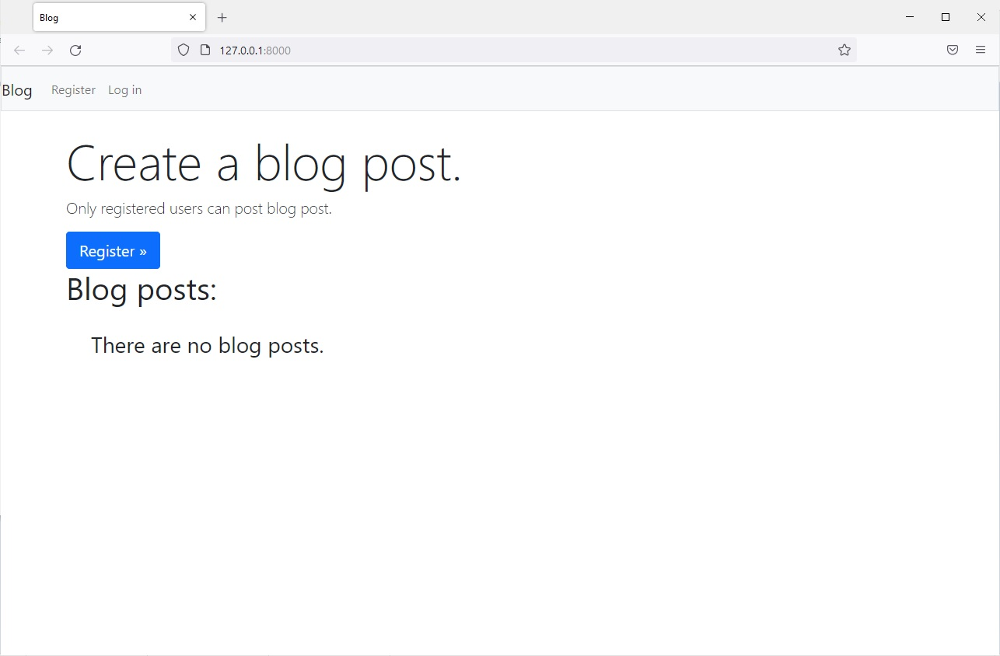

# Blog
___


В проекте создано приложение с именем blogs и моделью BlogPost. Модель содержит
такие поля, как title, text и date_added. Создана домашняя страница, на которой 
выводятся все сообщения в хронологическом порядке.
Сделана одна форма для создания новых сообщений и форма для редактирования
существующих сообщений.

Добавлена система аутентификации и регистрации. 
Пользователь, выполнивший вход, может видеть свое имя на экране,
а незарегистрированные пользователи видят ссылку на страницу регистрации.

Каждое сообщение в блоге связано с конкретным пользователем.
Чтение всех сообщений доступно всем пользователям, но только зарегистрированные
пользователи могут создавать новые и редактировать существующие сообщения.


## Настройка перед запуском

Первое, что нужно сделать, это cклонировать репозиторий:

```sh
$ git clone https://github.com/Andrei2020-web/Blog.git
$ cd blog
```

Создайте виртуальную среду для установки зависимостей и активируйте ее:

```sh
$ virtualenv venv
$ source venv/bin/activate
```

Затем установите зависимости:

```sh
(venv)$ pip install -r requirements.txt
```

Запускаем сервер:

```sh
(venv)$ python manage.py runserver
```